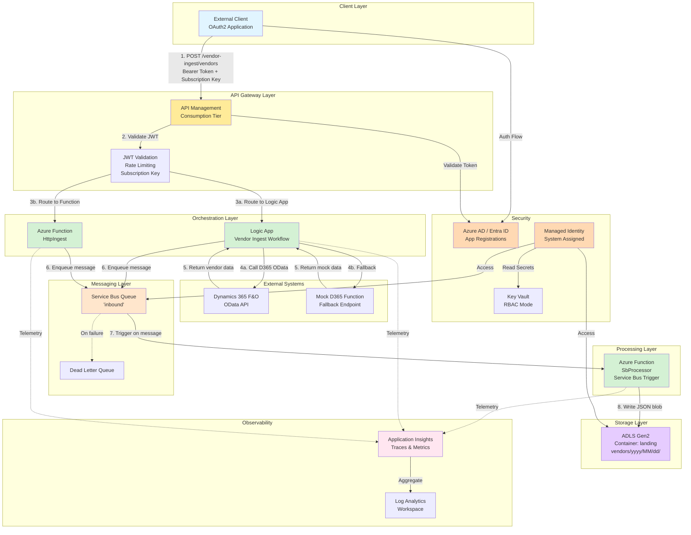
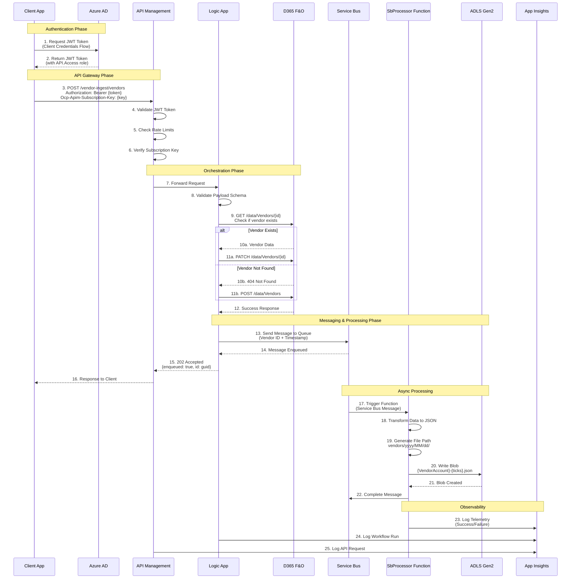
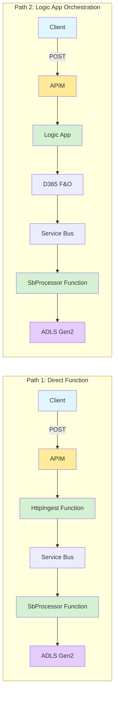
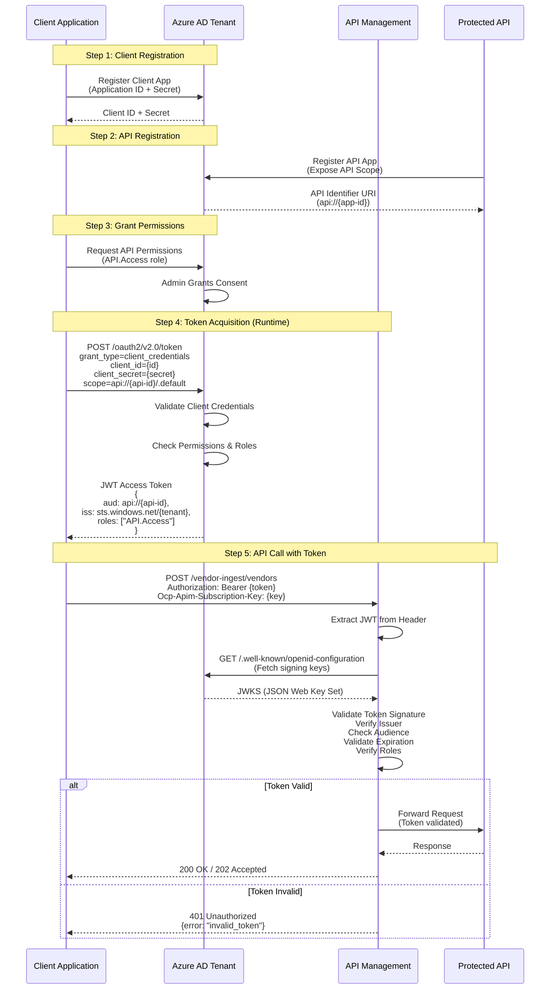
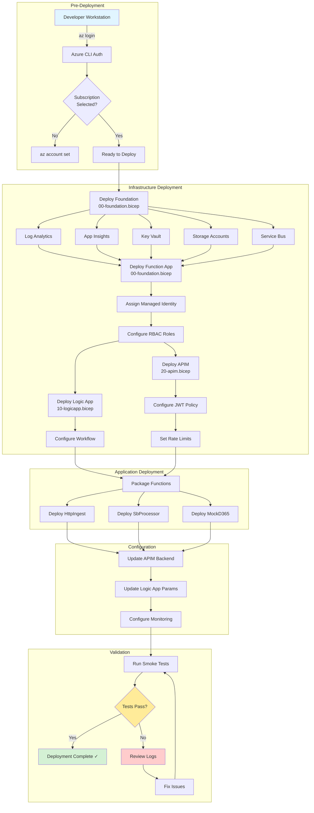
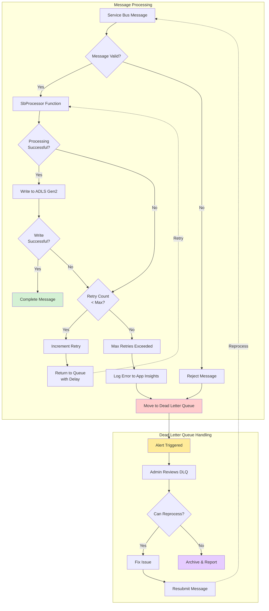
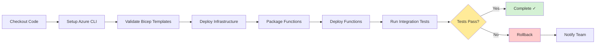

# Azure D365 Integration Demo

A production-ready demo showcasing Dynamics 365 Finance integration patterns using Azure API Management (JWT validation, rate limiting), Logic Apps for orchestration, Azure Functions (PowerShell) for event processing, Service Bus messaging, and ADLS Gen2 for data landing - all deployed via Bicep Infrastructure-as-Code.

## Table of Contents

- [Architecture Overview](#architecture-overview)
- [System Architecture Diagram](#system-architecture-diagram)
- [Data Flow](#data-flow)
- [Authentication Flow](#authentication-flow)
- [Prerequisites](#prerequisites)
- [Quick Deploy](#quick-deploy)
- [Testing the Demo](#testing-the-demo)
- [Monitoring & Observability](#monitoring--observability)
- [CI/CD Pipeline](#cicd-pipeline)
- [Troubleshooting](#troubleshooting)

## Architecture Overview

This solution demonstrates enterprise-grade integration patterns with Azure services, implementing a complete vendor data ingestion pipeline from external clients to Dynamics 365 Finance and data lake storage.

### Key Components

| Component | Purpose | Tier |
|-----------|---------|------|
| **Azure API Management** | API gateway with JWT validation, rate limiting, and API governance | Consumption |
| **Logic Apps** | Orchestration with D365 F&O integration | Consumption |
| **Azure Functions** | Event-driven processing with PowerShell runtime | Consumption |
| **Service Bus** | Reliable messaging with dead letter queues | Standard |
| **ADLS Gen2** | Data lake for landing transformed vendor data | Standard LRS |
| **Application Insights** | Observability and distributed tracing | Per GB |
| **Key Vault** | Secure secret management with RBAC | Standard |
| **Managed Identity** | Passwordless authentication throughout | N/A |

## System Architecture Diagram



## Data Flow

### End-to-End Data Flow Diagram



### Processing Paths



## Authentication Flow



## Deployment Workflow



## Error Handling & Retry Logic



## Prerequisites

1. **Azure CLI** installed and logged in (`az login`)
2. **Azure subscription** with appropriate permissions
3. **PowerShell 7+** (for PowerShell scripts)
4. **Git** for cloning the repository
5. **Azure AD permissions** to create app registrations

## Quick Deploy

### Option 1: Automated Setup (Recommended)

Use the pre-configured setup script with your Azure credentials:

#### Bash (macOS/Linux/WSL)
```bash
# Clone the repository
git clone https://github.com/ilyafedotov-ops/demo-integration.git
cd demo-integration

# Run setup
bash scripts/quick-setup.sh
```

#### PowerShell (Windows)
```powershell
# Clone the repository
git clone https://github.com/ilyafedotov-ops/demo-integration.git
cd demo-integration

# Run setup
.\scripts\quick-setup.ps1
```

This script will:
1. Create Azure AD app registration
2. Deploy all infrastructure via Bicep
3. Configure APIM with JWT validation
4. Deploy Azure Functions
5. Provide test credentials

### Option 2: Manual Step-by-Step Setup

<details>
<summary>Click to expand manual setup instructions</summary>

#### Step 1: Azure AD App Registration

```bash
# Set variables
TENANT_ID="your-tenant-id"
DISPLAY_NAME="D365-Demo-API"

# Create API app registration
az ad app create --display-name "$DISPLAY_NAME" --sign-in-audience AzureADMyOrg

# Get the app ID
API_APP_ID=$(az ad app list --display-name "$DISPLAY_NAME" --query "[0].appId" -o tsv)

# Create service principal
az ad sp create --id $API_APP_ID

# Create client app
az ad app create --display-name "D365-Demo-Client" --sign-in-audience AzureADMyOrg

CLIENT_APP_ID=$(az ad app list --display-name "D365-Demo-Client" --query "[0].appId" -o tsv)

# Create client secret
az ad app credential reset --id $CLIENT_APP_ID --append
```

#### Step 2: Deploy Infrastructure

```bash
# Login and set subscription
az login
az account set -s "your-subscription-id"

# Set deployment variables
LOCATION="westeurope"
RG_NAME="rg-d365-demo-v2"

# Create resource group
az group create -n $RG_NAME -l $LOCATION

# Deploy foundation (storage, service bus, functions, etc.)
az deployment group create \
  --resource-group $RG_NAME \
  --template-file infra/00-foundation.bicep \
  --parameters location=$LOCATION

# Deploy APIM with JWT validation
az deployment group create \
  --resource-group $RG_NAME \
  --template-file infra/20-apim.bicep \
  --parameters \
    tenantId=$TENANT_ID \
    apiAppId=$API_APP_ID

# Deploy Logic App
az deployment group create \
  --resource-group $RG_NAME \
  --template-file infra/10-logicapp.bicep
```

#### Step 3: Deploy Functions

```bash
# Get function app name
FUNC_APP_NAME=$(az functionapp list -g $RG_NAME --query "[0].name" -o tsv)

# Deploy functions
cd functions
func azure functionapp publish $FUNC_APP_NAME
```

</details>

## Testing the Demo

### Quick Test Script

Run the comprehensive test suite:

```bash
# Update test credentials in the script
cd test
./test-e2e-final.ps1
```

### Manual Testing

#### 1. Test HttpIngest Function

```bash
# Get function key
FUNC_KEY=$(az functionapp keys list -g rg-d365-demo-v2 -n <FUNC_APP_NAME> --query "functionKeys.default" -o tsv)

# Test the endpoint
curl -X POST "https://<FUNC_APP_NAME>.azurewebsites.net/api/HttpIngest?code=$FUNC_KEY" \
  -H "Content-Type: application/json" \
  -d @sample-vendor-payload.json
```

#### 2. Test with JWT Authentication via APIM

```powershell
# Acquire JWT token
$tokenBody = @{
    client_id     = "your-client-id"
    scope         = "api://your-api-id/.default"
    client_secret = "your-client-secret"
    grant_type    = "client_credentials"
}

$tokenResponse = Invoke-RestMethod `
    -Uri "https://login.microsoftonline.com/your-tenant-id/oauth2/v2.0/token" `
    -Method POST `
    -Body $tokenBody `
    -ContentType "application/x-www-form-urlencoded"

$accessToken = $tokenResponse.access_token

# Call APIM endpoint
$headers = @{
    "Authorization" = "Bearer $accessToken"
    "Ocp-Apim-Subscription-Key" = "your-subscription-key"
    "Content-Type" = "application/json"
}

Invoke-RestMethod `
    -Uri "https://<APIM_NAME>.azure-api.net/vendor-ingest/vendors" `
    -Method POST `
    -Headers $headers `
    -Body (Get-Content sample-vendor-payload.json -Raw)
```

#### 3. Verify Data Landing

```bash
# Check Service Bus queue
az servicebus queue show \
  -g rg-d365-demo-v2 \
  --namespace-name <SB_NAMESPACE> \
  -n inbound \
  --query "countDetails.activeMessageCount"

# Check ADLS Gen2 storage
az storage blob list \
  --account-name <STORAGE_ACCOUNT> \
  --container-name landing \
  --prefix "vendors/" \
  --auth-mode login \
  -o table
```

## Monitoring & Observability

### Application Insights

View real-time telemetry:

```bash
# Get Application Insights App ID
az monitor app-insights component show \
  -g rg-d365-demo-v2 \
  --query "[0].appId" -o tsv
```

Navigate to Azure Portal → Application Insights to view:
- Live metrics stream
- Transaction traces
- Dependency calls
- Performance metrics
- Failure analytics

### Log Analytics Queries

```kusto
// Function execution logs
traces
| where cloud_RoleName == "demo-func-xxxxx"
| where timestamp > ago(1h)
| order by timestamp desc

// Failed requests
requests
| where success == false
| where timestamp > ago(24h)
| summarize count() by resultCode, operation_Name

// Service Bus processing metrics
dependencies
| where type == "Azure Service Bus"
| summarize avg(duration), count() by bin(timestamp, 5m)
```

### Configure Alerts

```bash
# Run monitoring setup script
./scripts/setup-monitoring.ps1
```

This creates alert rules for:
- Function execution failures (>5 in 5 minutes)
- Logic App failures (>3 in 15 minutes)
- APIM response time (>5 seconds)
- Service Bus queue depth (>100 messages)

## CI/CD Pipeline

The project includes a GitHub Actions workflow for automated deployment.

### Setup GitHub Secrets

Configure the following secrets in your GitHub repository:

| Secret Name | Description |
|-------------|-------------|
| `AZURE_CREDENTIALS` | Service principal JSON credentials |
| `AZURE_SUBSCRIPTION_ID` | Target Azure subscription ID |
| `AZURE_TENANT_ID` | Azure AD tenant ID |
| `APP_REGISTRATION_CLIENT_ID` | API app registration client ID |

### Workflow Triggers

- Push to `main` branch
- Pull requests to `main`
- Manual workflow dispatch

### Pipeline Stages



## Project Structure

```
demo-integration/
├── .github/
│   └── workflows/
│       └── deploy.yml              # CI/CD pipeline
├── docs/                           # Documentation files
├── test/                           # Test scripts and utilities
├── infra/                          # Bicep templates
│   ├── 00-foundation.bicep         # Core resources
│   ├── 10-logicapp.bicep          # Logic App
│   └── 20-apim.bicep              # API Management
├── functions/                      # Azure Functions
│   ├── HttpIngest/                # HTTP → Service Bus
│   ├── SbProcessor/               # Service Bus → ADLS
│   └── MockD365/                  # Mock D365 endpoint
├── logicapp/                       # Logic App definitions
├── scripts/                        # Deployment scripts
│   ├── quick-setup.sh             # Automated setup
│   ├── deploy-one-liner.sh        # Manual deployment
│   ├── test-demo.sh               # Testing
│   └── cleanup.sh                 # Resource cleanup
├── README.md                       # This file
├── sample-vendor-payload.json     # Test data
└── config.env.example             # Environment template
```

## Troubleshooting

### Common Issues

<details>
<summary>JWT Token Validation Fails</summary>

**Symptoms**: 401 Unauthorized from APIM

**Solutions**:
1. Verify token audience matches API app identifier:
   ```bash
   # Decode token at https://jwt.ms
   # Check "aud" claim matches "api://{your-api-id}"
   ```
2. Ensure APIM policy has correct tenant ID and audience
3. Check token expiration (`exp` claim)
4. Verify app roles are present in token (`roles` claim)

</details>

<details>
<summary>Function Deployment Fails</summary>

**Symptoms**: Deployment errors or functions not visible

**Solutions**:
1. Check PowerShell runtime version in `host.json`
2. Verify `requirements.psd1` dependencies
3. Check managed identity has required permissions:
   ```bash
   az role assignment list --assignee <PRINCIPAL_ID>
   ```
4. Review deployment logs:
   ```bash
   az functionapp log deployment list -g rg-d365-demo-v2 -n <FUNC_APP>
   ```

</details>

<details>
<summary>Service Bus Connection Issues</summary>

**Symptoms**: Functions not triggering, messages stuck in queue

**Solutions**:
1. Verify managed identity has Service Bus Data Receiver role
2. Check connection string in function app settings (should use managed identity)
3. Review dead letter queue for failed messages:
   ```bash
   az servicebus queue show \
     -g rg-d365-demo-v2 \
     --namespace-name <SB_NAMESPACE> \
     -n inbound \
     --query "countDetails.deadLetterMessageCount"
   ```

</details>

<details>
<summary>ADLS Gen2 Write Failures</summary>

**Symptoms**: Messages processed but no files in storage

**Solutions**:
1. Verify Storage Blob Data Contributor role on managed identity
2. Check storage account firewall settings
3. Review function logs in Application Insights:
   ```kusto
   traces
   | where message contains "ADLS"
   | order by timestamp desc
   ```

</details>

## Cleanup

### Quick Cleanup

```bash
# Delete all resources
bash scripts/cleanup.sh
```

### Manual Cleanup

```bash
# Delete resource group (removes all resources)
az group delete -n rg-d365-demo-v2 --yes --no-wait

# Delete Azure AD app registrations (optional)
az ad app delete --id <CLIENT_APP_ID>
az ad app delete --id <API_APP_ID>
```

## Cost Estimation

| Service | Tier | Estimated Cost (USD/month) |
|---------|------|---------------------------|
| API Management | Consumption | $3.50 per million calls |
| Function App | Consumption | Free (first 1M executions) |
| Logic App | Consumption | $0.000025 per action |
| Service Bus | Standard | ~$10 |
| Storage (ADLS Gen2) | Standard LRS | ~$0.02/GB |
| Application Insights | Pay-as-you-go | First 5GB free |
| **Total (light usage)** | | **~$15-20/month** |

## References

- [Azure API Management Documentation](https://learn.microsoft.com/azure/api-management/)
- [Dynamics 365 Finance OData API](https://learn.microsoft.com/dynamics365/fin-ops-core/dev-itpro/data-entities/odata)
- [Azure Functions PowerShell Developer Guide](https://learn.microsoft.com/azure/azure-functions/functions-reference-powershell)
- [Service Bus Messaging](https://learn.microsoft.com/azure/service-bus-messaging/)
- [ADLS Gen2 Best Practices](https://learn.microsoft.com/azure/storage/blobs/data-lake-storage-best-practices)
- [Bicep Documentation](https://learn.microsoft.com/azure/azure-resource-manager/bicep/)

## Contributing

Contributions are welcome! Please feel free to submit a Pull Request.

## License

This project is licensed under the MIT License - see the LICENSE file for details.

---

**Built with ❤️ using Azure and Infrastructure-as-Code**
