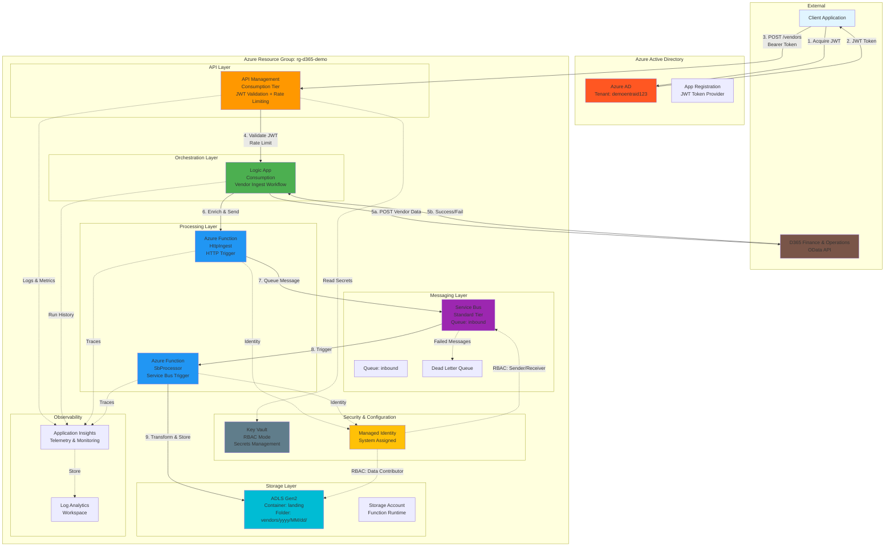
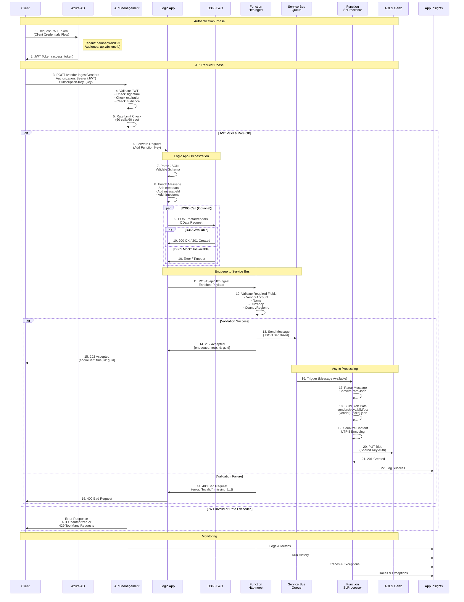
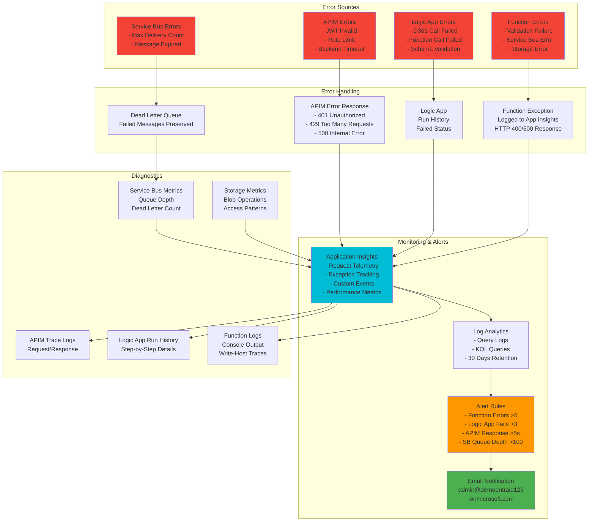
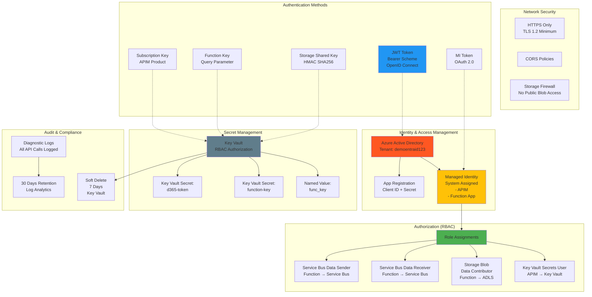
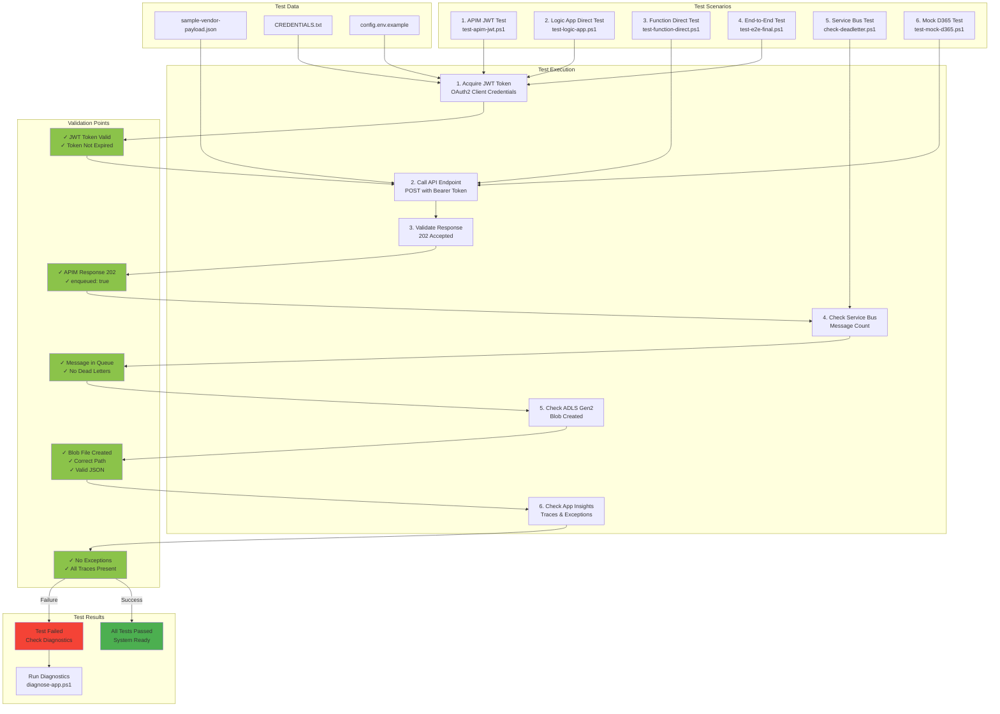
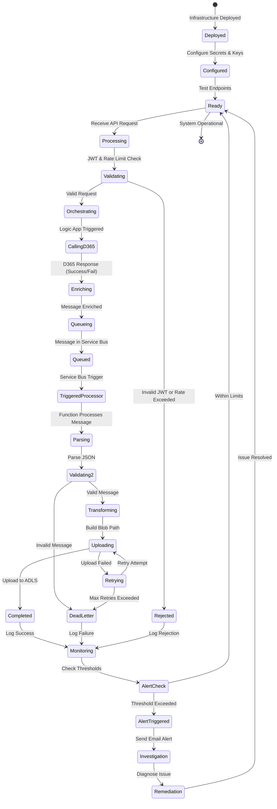

# D365 Integration Solution - Architecture Diagrams

This document contains comprehensive Mermaid diagrams illustrating the complete architecture, workflows, and data flows of the D365 Integration Demo solution.

---

## 1. High-Level Architecture Overview



---

## 2. Detailed Data Flow - End-to-End



---

## 3. Authentication & Authorization Flow

```mermaid
graph LR
    subgraph "Client Side"
        App[Client Application]
        AppConfig[App Configuration<br/>Tenant ID<br/>Client ID<br/>Client Secret<br/>Scope]
    end
    
    subgraph "Azure Active Directory"
        TokenEndpoint[Token Endpoint<br/>https://login.microsoft<br/>online.com/{tenant}/<br/>oauth2/v2.0/token]
        AADValidation[Token Validation<br/>- Signature Check<br/>- Expiration Check<br/>- Audience Check]
    end
    
    subgraph "API Management"
        JWTPolicy[validate-jwt Policy<br/>- OpenID Config<br/>- Audience Validation<br/>- Require Bearer Scheme]
        RateLimit[rate-limit-by-key<br/>- 60 calls/60 sec<br/>- Per Subscription Key]
    end
    
    subgraph "Backend Services"
        FuncAuth[Function Authentication<br/>Function Key via Query]
        MIAuth[Managed Identity<br/>System Assigned]
    end
    
    subgraph "Azure Resources"
        SBAuth[Service Bus<br/>RBAC: Sender + Receiver]
        StorageAuth[ADLS Gen2<br/>RBAC: Blob Data Contributor<br/>OR Shared Key]
    end
    
    %% Authentication flow
    App -->|1. Get Config| AppConfig
    App -->|2. POST Client Credentials| TokenEndpoint
    TokenEndpoint -->|3. JWT Token| App
    App -->|4. Bearer Token| JWTPolicy
    JWTPolicy -->|5. Validate| AADValidation
    AADValidation -->|6. Valid| RateLimit
    RateLimit -->|7. Rate OK| FuncAuth
    FuncAuth -->|8. Authenticated| MIAuth
    
    %% Authorization flow
    MIAuth -->|RBAC Authorization| SBAuth
    MIAuth -->|RBAC Authorization| StorageAuth
    
    style TokenEndpoint fill:#ff5722
    style JWTPolicy fill:#ff9800
    style MIAuth fill:#ffc107
    style SBAuth fill:#9c27b0
    style StorageAuth fill:#00bcd4
```

---

## 4. Component-Level Architecture

```mermaid
graph TB
    subgraph "API Management Layer"
        APIMService[APIM Service<br/>Consumption Tier]
        APIMBackend[Backend: Function]
        APIMProduct[Product: D365 Demo<br/>Subscription Required]
        APIMApi[API: vendor-ingest<br/>Path: /vendor-ingest]
        APIMOp[Operation: POST /vendors]
        APIMPolicy[Policies:<br/>- validate-jwt<br/>- rate-limit-by-key<br/>- rewrite-uri<br/>- set-query-parameter]
    end
    
    subgraph "Logic App Workflow"
        LATrigger[Trigger:<br/>HTTP Request<br/>Method: POST]
        LAParseJSON[Action: Parse JSON<br/>Validate Schema]
        LAEnrich[Action: Compose<br/>Enrich Message]
        LAD365Call[Action: HTTP<br/>Call D365 OData]
        LAFuncCall[Action: HTTP<br/>Call Function HttpIngest]
        LAResponse[Action: Response<br/>202 Accepted]
    end
    
    subgraph "Function App - HttpIngest"
        FHBinding[Bindings:<br/>- HTTP Trigger<br/>- Service Bus Output]
        FHValidation[Logic:<br/>1. Parse JSON<br/>2. Validate Fields<br/>3. Enrich if needed]
        FHQueue[Output:<br/>Queue Message to SB]
        FHResponse[Response:<br/>202 Accepted]
    end
    
    subgraph "Function App - SbProcessor"
        FSBinding[Bindings:<br/>- Service Bus Trigger<br/>Queue: inbound]
        FSParse[Logic:<br/>1. Parse Message<br/>2. Build Blob Path<br/>3. Serialize Content]
        FSUpload[Output:<br/>Upload to ADLS<br/>REST API with<br/>Shared Key Auth]
        FSLog[Logging:<br/>Application Insights<br/>Detailed Traces]
    end
    
    subgraph "Service Bus"
        SBQueue[Queue: inbound<br/>Max Delivery: 10<br/>Dead Letter: Enabled]
        SBDeadLetter[Dead Letter Queue<br/>Failed Messages]
    end
    
    subgraph "Storage"
        ADLSContainer[Container: landing]
        ADLSFolder[Folder Structure:<br/>vendors/<br/>  yyyy/<br/>    MM/<br/>      dd/<br/>        {vendor}-{ticks}.json]
    end
    
    %% Connections
    APIMService --> APIMBackend
    APIMService --> APIMProduct
    APIMProduct --> APIMApi
    APIMApi --> APIMOp
    APIMOp --> APIMPolicy
    
    LATrigger --> LAParseJSON
    LAParseJSON --> LAEnrich
    LAEnrich --> LAD365Call
    LAD365Call --> LAFuncCall
    LAFuncCall --> LAResponse
    
    FHBinding --> FHValidation
    FHValidation --> FHQueue
    FHQueue --> FHResponse
    
    FSBinding --> FSParse
    FSParse --> FSUpload
    FSUpload --> FSLog
    
    SBQueue --> SBDeadLetter
    
    ADLSContainer --> ADLSFolder
    
    style APIMService fill:#ff9800
    style LATrigger fill:#4caf50
    style FHBinding fill:#2196f3
    style FSBinding fill:#2196f3
    style SBQueue fill:#9c27b0
    style ADLSContainer fill:#00bcd4
```

---

## 5. Infrastructure as Code - Bicep Modules

```mermaid
graph TB
    subgraph "Bicep Deployment"
        Main[main.bicep<br/>or deploy scripts]
    end
    
    subgraph "00-foundation.bicep"
        Foundation[Foundation Resources]
        LAW[Log Analytics<br/>Workspace]
        APPI[Application Insights]
        KV2[Key Vault<br/>RBAC Mode]
        StData[Storage: Data Lake<br/>ADLS Gen2 Enabled]
        StApp[Storage: Function Runtime]
        SB2[Service Bus Namespace<br/>+ Queue: inbound]
        APIM2[APIM Service<br/>System Managed Identity]
        Func[Function App<br/>PowerShell Runtime<br/>System Managed Identity]
        Plan[App Service Plan<br/>Consumption]
        RBAC[RBAC Assignments:<br/>- Service Bus Sender<br/>- Service Bus Receiver<br/>- Blob Data Contributor]
    end
    
    subgraph "10-logicapp.bicep"
        LA2[Logic App<br/>Consumption]
        LADef[Workflow Definition<br/>from JSON file]
        LAParams[Parameters:<br/>- functionBaseUrl<br/>- functionKey<br/>- d365HostUrl<br/>- d365AccessToken]
    end
    
    subgraph "20-apim.bicep"
        APIMConf[APIM Configuration]
        APIMNamedValues[Named Values<br/>func_key]
        APIMBackend2[Backend: Function]
        APIMApi2[API Definition<br/>vendor-ingest]
        APIMOp2[Operation:<br/>POST /vendors]
        APIMApiPolicy[API Policy:<br/>- validate-jwt<br/>- rewrite-uri<br/>- set-query-parameter]
        APIMProduct2[Product:<br/>d365-demo]
        APIMProductApi[Product-API Link]
        APIMLanding[Landing Page API<br/>Root Path /]
    end
    
    subgraph "External Files"
        FuncCode[functions/<br/>- HttpIngest/run.ps1<br/>- SbProcessor/run.ps1<br/>- host.json<br/>- requirements.psd1]
        LAJson[logicapp/<br/>logicapp.vendor.ingest<br/>.definition.json]
    end
    
    %% Deployment flow
    Main --> Foundation
    Foundation --> LAW
    Foundation --> APPI
    Foundation --> KV2
    Foundation --> StData
    Foundation --> StApp
    Foundation --> SB2
    Foundation --> APIM2
    Foundation --> Plan
    Plan --> Func
    Func --> RBAC
    
    Main --> LA2
    LA2 --> LADef
    LADef --> LAParams
    LAJson -.->|Load Content| LADef
    
    Main --> APIMConf
    APIMConf --> APIMNamedValues
    APIMConf --> APIMBackend2
    APIMConf --> APIMApi2
    APIMApi2 --> APIMOp2
    APIMOp2 --> APIMApiPolicy
    APIMConf --> APIMProduct2
    APIMProduct2 --> APIMProductApi
    APIMConf --> APIMLanding
    
    FuncCode -.->|Deploy as Package| Func
    
    style Foundation fill:#4caf50
    style LA2 fill:#8bc34a
    style APIMConf fill:#ff9800
    style FuncCode fill:#03a9f4
    style LAJson fill:#03a9f4
```



---

## 6. Error Handling & Monitoring



---

## 7. Data Model & Message Schema

```mermaid
classDiagram
    class ClientRequest {
        +string VendorAccount*
        +string Name*
        +string Currency*
        +string CountryRegionId*
        +Address Address
        +string Email
        +string Phone
    }
    
    class Address {
        +string Street
        +string City
        +string PostalCode
    }
    
    class EnrichedMessage {
        +string type = "vendor"
        +string version = "1.0"
        +VendorData data
        +Metadata meta
    }
    
    class VendorData {
        +string VendorAccount
        +string Name
        +string Currency
        +string CountryRegionId
        +Address Address
        +string Email
        +string Phone
    }
    
    class Metadata {
        +string source
        +string receivedAtUtc
        +string messageId
    }
    
    class ServiceBusMessage {
        +string ContentType = "application/json"
        +EnrichedMessage Body
        +MessageProperties Properties
    }
    
    class BlobStorageFile {
        +string Container = "landing"
        +string Path = "vendors/yyyy/MM/dd/{vendor}-{ticks}.json"
        +EnrichedMessage Content
        +string ContentType = "application/json"
    }
    
    class D365Request {
        +string VendorAccount
        +string Name
        +string VendorGroup
        +string Currency
        +string PaymentTerms
        +string CountryRegionId
    }
    
    ClientRequest --> Address
    ClientRequest --> EnrichedMessage : Logic App Enriches
    EnrichedMessage --> VendorData
    EnrichedMessage --> Metadata
    VendorData --> Address
    EnrichedMessage --> ServiceBusMessage : Serialized to
    ServiceBusMessage --> BlobStorageFile : Processed into
    ClientRequest --> D365Request : Transformed for D365
    
    note for EnrichedMessage "Added by Logic App or HttpIngest Function"
    note for Metadata "messageId: GUID, receivedAtUtc: ISO 8601"
    note for BlobStorageFile "One file per vendor submission"
```

---

## 8. Security Architecture



---

## 9. Deployment Pipeline

```mermaid
graph LR
    subgraph "Source Control"
        Repo[GitHub Repository<br/>Main Branch]
        PR[Pull Request]
        Merge[Merge to Main]
    end
    
    subgraph "CI/CD - GitHub Actions"
        Trigger[Workflow Trigger<br/>Push or PR]
        Checkout[Checkout Code]
        BuildFunc[Build Functions<br/>Package PowerShell]
        ValidateBicep[Validate Bicep<br/>Lint & Test]
        DeployInfra[Deploy Infrastructure<br/>Bicep Modules]
        DeployFunc[Deploy Function Code<br/>ZIP Deploy]
        DeployLA[Deploy Logic App<br/>Update Definition]
        ConfigAPIM[Configure APIM<br/>Policies & Products]
        SmokeTest[Run Smoke Tests<br/>test-demo.ps1]
        Cleanup[Cleanup on Failure]
    end
    
    subgraph "Azure Resources"
        RG[Resource Group<br/>rg-d365-demo]
        Resources[All Resources<br/>Created/Updated]
    end
    
    subgraph "Testing & Verification"
        Test1[Test APIM Endpoint<br/>JWT Authentication]
        Test2[Test Logic App<br/>Direct Invocation]
        Test3[Test Function<br/>HTTP Trigger]
        Test4[Verify Service Bus<br/>Queue Messages]
        Test5[Verify ADLS<br/>Blob Landing]
    end
    
    subgraph "Monitoring Setup"
        SetupAlerts[Configure Alerts<br/>setup-monitoring.ps1]
        AlertRules[Alert Rules Created<br/>4 Rules]
        ActionGroup[Action Group<br/>Email: admin@...]
    end
    
    %% Flow
    Repo --> PR
    PR --> Merge
    Merge --> Trigger
    
    Trigger --> Checkout
    Checkout --> BuildFunc
    BuildFunc --> ValidateBicep
    ValidateBicep --> DeployInfra
    DeployInfra --> RG
    RG --> Resources
    DeployInfra --> DeployFunc
    DeployFunc --> DeployLA
    DeployLA --> ConfigAPIM
    ConfigAPIM --> SmokeTest
    
    SmokeTest --> Test1
    SmokeTest --> Test2
    SmokeTest --> Test3
    SmokeTest --> Test4
    SmokeTest --> Test5
    
    Test5 -->|Success| SetupAlerts
    Test5 -->|Failure| Cleanup
    
    SetupAlerts --> AlertRules
    AlertRules --> ActionGroup
    
    style Trigger fill:#4caf50
    style DeployInfra fill:#2196f3
    style SmokeTest fill:#ff9800
    style Resources fill:#00bcd4
    style ActionGroup fill:#f44336
```



---

## 10. Testing Strategy



---

## 11. Operational Workflows



---

## Summary

This comprehensive diagram set covers:

1. **High-Level Architecture** - Overall system components and connections
2. **Detailed Data Flow** - Step-by-step sequence of operations
3. **Authentication Flow** - JWT and RBAC authorization
4. **Component Architecture** - Individual service configurations
5. **Infrastructure as Code** - Bicep deployment structure
6. **Error Handling** - Error sources and monitoring
7. **Data Model** - Message schemas and transformations
8. **Security Architecture** - Identity, secrets, and access control
9. **Deployment Pipeline** - CI/CD workflow
10. **Testing Strategy** - Comprehensive test scenarios
11. **Operational Workflows** - State transitions and operations

### Key Technologies

- **Azure API Management** (JWT validation, rate limiting)
- **Logic Apps** (Orchestration, D365 integration)
- **Azure Functions** (PowerShell, event-driven processing)
- **Service Bus** (Reliable messaging)
- **ADLS Gen2** (Data lake storage)
- **Application Insights** (Monitoring and observability)
- **Bicep** (Infrastructure as Code)
- **Azure Active Directory** (Authentication and authorization)

### Resource Naming Convention

- Prefix: `d365demo` or `demo`
- Suffix: `{uniqueString}` (8 characters)
- Resource Group: `rg-d365-demo`
- Location: `westeurope`

### Contact

- Admin Email: `admin@demoentraid123.onmicrosoft.com`
- Tenant: `demoentraid123.onmicrosoft.com`
- Subscription: `{your-subscription-id}`
